Assignment 1. Peer 2 peer Loans
========================================================

This is the raw code of the 1st assigment for the Data Analysis course.

The data used for this assignment consist of a sample of 2,500 peer-to-peer loans issued through the [Lending Club](https://www.lendingclub.com/home.action). The interest rate of these loans is determined by the Lending Club on the basis of characteristics of the person asking for the loan such as their employment history, credit history, and creditworthiness scores. 

The purpose of this analysis is to identify and quantify associations between the interest rate of the loan and the other variables in the data set. 

For example, if two people have the same FICO score, can the other variables explain a difference in interest rate between them?

## Preliminaries

Load libraries and data, create variables.


```r

# Libraries
library(Hmisc)
```

```
## Loading required package: survival
```

```
## Loading required package: splines
```

```
## Hmisc library by Frank E Harrell Jr
## 
## Type library(help='Hmisc'), ?Overview, or ?Hmisc.Overview') to see overall
## documentation.
## 
## NOTE:Hmisc no longer redefines [.factor to drop unused levels when
## subsetting.  To get the old behavior of Hmisc type dropUnusedLevels().
```

```
## Attaching package: 'Hmisc'
```

```
## The following object(s) are masked from 'package:survival':
## 
## untangle.specials
```

```
## The following object(s) are masked from 'package:base':
## 
## format.pval, round.POSIXt, trunc.POSIXt, units
```

```r

# Data
fileURL <- "https://spark-public.s3.amazonaws.com/dataanalysis/loansData.rda"
download.file(fileURL, destfile = "../../data/loansData.rda", method = "curl")
dateDownloaded <- date()
dateDownloaded
```

```
## [1] "Mon Feb 18 00:04:44 2013"
```

```r

load("../../data/loansData.rda")

# Data overview (pre-exploratory)
summary(loansData$Loan.Length)
```

```
##           36 months 60 months 
##         0      1952       548
```

```r
head(loansData)
```

```
##       Amount.Requested Amount.Funded.By.Investors Interest.Rate
## 81174            20000                      20000         8.90%
## 99592            19200                      19200        12.12%
## 80059            35000                      35000        21.98%
## 15825            10000                       9975         9.99%
## 33182            12000                      12000        11.71%
## 62403             6000                       6000        15.31%
##       Loan.Length       Loan.Purpose Debt.To.Income.Ratio State
## 81174   36 months debt_consolidation               14.90%    SC
## 99592   36 months debt_consolidation               28.36%    TX
## 80059   60 months debt_consolidation               23.81%    CA
## 15825   36 months debt_consolidation               14.30%    KS
## 33182   36 months        credit_card               18.78%    NJ
## 62403   36 months              other               20.05%    CT
##       Home.Ownership Monthly.Income FICO.Range Open.CREDIT.Lines
## 81174       MORTGAGE           6542    735-739                14
## 99592       MORTGAGE           4583    715-719                12
## 80059       MORTGAGE          11500    690-694                14
## 15825       MORTGAGE           3833    695-699                10
## 33182           RENT           3195    695-699                11
## 62403            OWN           4892    670-674                17
##       Revolving.CREDIT.Balance Inquiries.in.the.Last.6.Months
## 81174                    14272                              2
## 99592                    11140                              1
## 80059                    21977                              1
## 15825                     9346                              0
## 33182                    14469                              0
## 62403                    10391                              2
##       Employment.Length
## 81174          < 1 year
## 99592           2 years
## 80059           2 years
## 15825           5 years
## 33182           9 years
## 62403           3 years
```

```r
sum(is.na(loansData))
```

```
## [1] 7
```

```r
sapply(loansData[1, ], class)
```

```
##               Amount.Requested     Amount.Funded.By.Investors 
##                      "integer"                      "numeric" 
##                  Interest.Rate                    Loan.Length 
##                       "factor"                       "factor" 
##                   Loan.Purpose           Debt.To.Income.Ratio 
##                       "factor"                       "factor" 
##                          State                 Home.Ownership 
##                       "factor"                       "factor" 
##                 Monthly.Income                     FICO.Range 
##                      "numeric"                       "factor" 
##              Open.CREDIT.Lines       Revolving.CREDIT.Balance 
##                      "integer"                      "integer" 
## Inquiries.in.the.Last.6.Months              Employment.Length 
##                      "integer"                       "factor"
```


There are only 7 NA's in total, while checking details of NA's, turns out they're only 2 lines, so it's safe to ignore them since they don't represent a significant amount.

So we see a lot of fields are factors, we need to convert them to numeric where possible


```r
# Define local cleaned variables
procLoansData <- na.omit(loansData)

# store Interest rate and debt to income ratio as numeric
procLoansData$Interest.Rate.numeric <- as.numeric(gsub("%", "", procLoansData$Interest.Rate))
procLoansData$Debt.To.Income.Ratio.numeric <- as.numeric(gsub("%", "", procLoansData$Debt.To.Income.Ratio))

# store FICO range as numeric
FICO.Range.split <- strsplit(as.character(procLoansData$FICO.Range), "-")
pickFirst <- function(x) {
    as.numeric(x[1])
}
procLoansData$FICO.Range.numeric <- sapply(FICO.Range.split, pickFirst)
```


## Exploratory


```r
par(mfrow = c(1, 1))
hist(procLoansData$Interest.Rate.numeric)
```

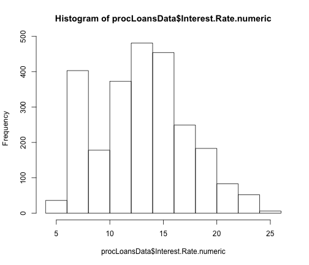 


Interest Rate doesn't seem to have normal distribution, but it's not heavily skewed. We can keep the variable as is.


```r
hist(procLoansData$Amount.Requested)
```

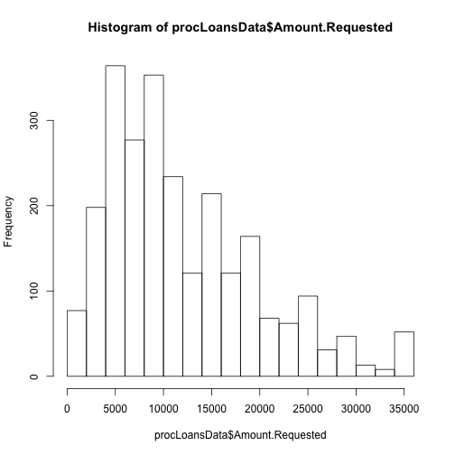 

```r
procLoansData$Amount.Requested.log10 <- log10(procLoansData$Amount.Requested)
hist(procLoansData$Amount.Requested.log10)
```

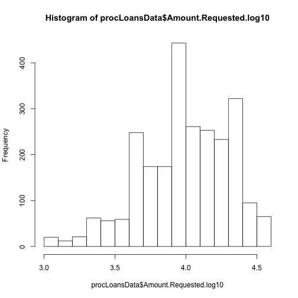 


Amount requested is quite skewed, we will use a log based function and check whether it's worth using it with regression models.


```r
table(procLoansData$Loan.Length)
```

```
## 
##           36 months 60 months 
##         0      1950       548
```


Loans in 36 months are 4x the amount of 60 months loans.


```r
boxplot(procLoansData$Interest.Rate.numeric ~ cut2(procLoansData$Amount.Requested, 
    g = 6), col = "#77cc00", varwidth = TRUE)
```

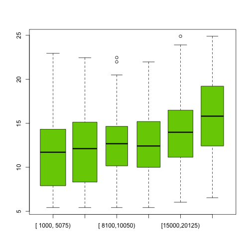 


Interest increasing when amount requested grows.


```r
plot(procLoansData$Amount.Requested, procLoansData$Interest.Rate.numeric, col = procLoansData$Loan.Length, 
    pch = 20, cex = 0.6)
```

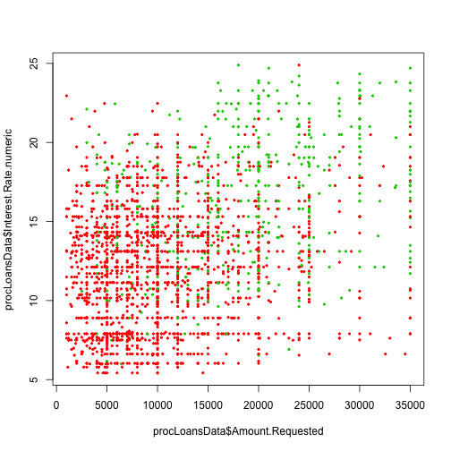 


Interest rate higher for longer & higher loans (fair enough)


```r
boxplot(procLoansData$Interest.Rate.numeric ~ procLoansData$FICO.Range, col = "#cc7700", 
    varwidth = TRUE)
```

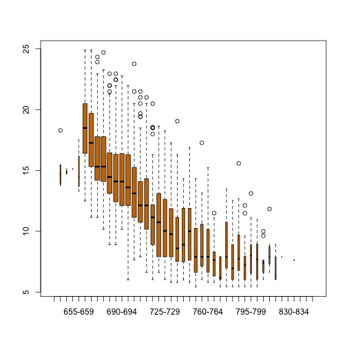 

```r
plot(jitter(procLoansData$FICO.Range.numeric), jitter(procLoansData$Interest.Rate.numeric), 
    pch = 20, cex = 0.6)
```

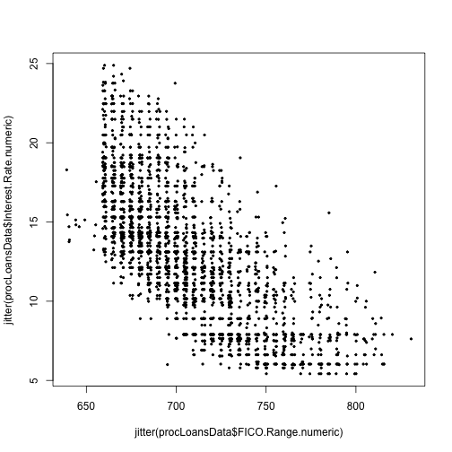 


Interest lower for higher FICO (box & scatter)


```r
plot(jitter(procLoansData$Amount.Requested), jitter(procLoansData$Amount.Funded.By.Investors), 
    col = cut2(procLoansData$FICO.Range.numeric, g = 4), pch = 20, cex = 0.5)
```

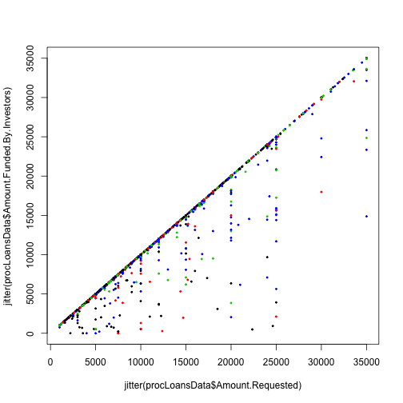 


Funded always lower than requested (easy), and equally distributed across fico ranges

now try and see if we can visually find some clusters on the fico.range / interest.rate scatter plot


```r
plot(jitter(procLoansData$FICO.Range.numeric), jitter(procLoansData$Interest.Rate.numeric), 
    col = procLoansData$Loan.Length, pch = 20, cex = 0.6)
```

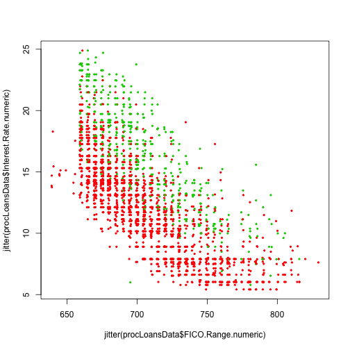 


loan length gives 2 big clusters


```r
plot(jitter(procLoansData$FICO.Range.numeric), jitter(procLoansData$Interest.Rate.numeric), 
    col = cut2(procLoansData$Amount.Requested, g = 2), pch = 20, cex = 0.6)
```

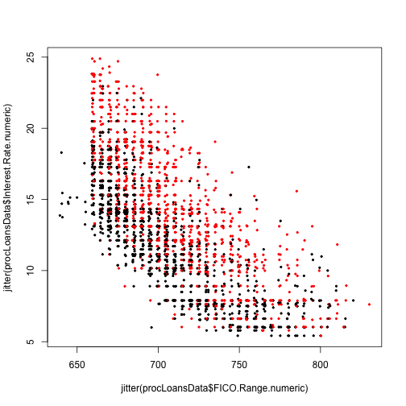 


amount requested gives 2 clear clusters, tried sub-grouping more, with no luck


```r
plot(jitter(procLoansData$FICO.Range.numeric), jitter(procLoansData$Interest.Rate.numeric), 
    col = procLoansData$Home.Ownership, pch = 20, cex = 0.6)
```

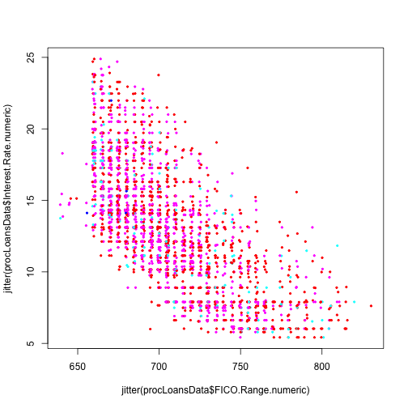 


group by home ownership doesn't give big clues


```r
plot(jitter(procLoansData$FICO.Range.numeric), jitter(procLoansData$Interest.Rate.numeric), 
    col = cut2(procLoansData$Debt.To.Income.Ratio.numeric, g = 5), pch = 20, 
    cex = 0.6)
```

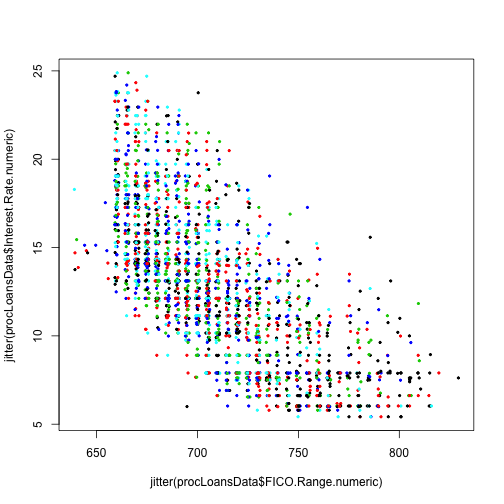 


same happens when grouped by debt to income ratio: no clues. tried also other factors (monthly income and employment length), none of them giving clear clusters on the FICO/Interest.Rate scatter plot.

# Analysis

## Linear model 1. interest rate is outcome and FICO is the only variable

start fitting some models


```r
lm_interest_fico <- lm(procLoansData$Interest.Rate.numeric ~ procLoansData$FICO.Range.numeric)
lm_interest_fico_factor <- lm(procLoansData$Interest.Rate.numeric ~ procLoansData$FICO.Range)

# use this plot as reference so we can add fitted lines on top
plot(jitter(procLoansData$FICO.Range.numeric), jitter(procLoansData$Interest.Rate.numeric), 
    col = cut2(procLoansData$Amount.Requested, g = 2), pch = 20, cex = 0.6)
abline(lm_interest_fico, col = "black")
```

 


fitted line is clear, now plot the residuals


```r
par(mfrow = c(1, 3))
plot(procLoansData$FICO.Range.numeric, lm_interest_fico$residuals, col = cut2(procLoansData$Interest.Rate.numeric, 
    g = 4), pch = 20, cex = 0.7)
plot(procLoansData$FICO.Range.numeric, lm_interest_fico$residuals, col = cut2(procLoansData$Amount.Requested, 
    g = 2), pch = 20, cex = 0.7)
plot(procLoansData$FICO.Range.numeric, lm_interest_fico$residuals, col = procLoansData$Loan.Length, 
    pch = 20, cex = 0.7)
```

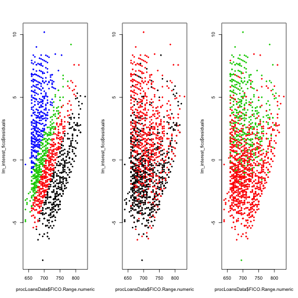 


some nice non-random patterns here.


```r
summary(lm_interest_fico)
```

```
## 
## Call:
## lm(formula = procLoansData$Interest.Rate.numeric ~ procLoansData$FICO.Range.numeric)
## 
## Residuals:
##    Min     1Q Median     3Q    Max 
## -7.990 -2.136 -0.456  1.835 10.194 
## 
## Coefficients:
##                                  Estimate Std. Error t value Pr(>|t|)    
## (Intercept)                      72.83876    1.19066    61.2   <2e-16 ***
## procLoansData$FICO.Range.numeric -0.08467    0.00168   -50.3   <2e-16 ***
## ---
## Signif. codes:  0 '***' 0.001 '**' 0.01 '*' 0.05 '.' 0.1 ' ' 1 
## 
## Residual standard error: 2.95 on 2496 degrees of freedom
## Multiple R-squared: 0.503,	Adjusted R-squared: 0.503 
## F-statistic: 2.53e+03 on 1 and 2496 DF,  p-value: <2e-16
```

```r
anova(lm_interest_fico)
```

```
## Analysis of Variance Table
## 
## Response: procLoansData$Interest.Rate.numeric
##                                    Df Sum Sq Mean Sq F value Pr(>F)    
## procLoansData$FICO.Range.numeric    1  21924   21924    2526 <2e-16 ***
## Residuals                        2496  21663       9                   
## ---
## Signif. codes:  0 '***' 0.001 '**' 0.01 '*' 0.05 '.' 0.1 ' ' 1
```

```r

summary(lm_interest_fico_factor)
```

```
## 
## Call:
## lm(formula = procLoansData$Interest.Rate.numeric ~ procLoansData$FICO.Range)
## 
## Residuals:
##    Min     1Q Median     3Q    Max 
## -8.147 -2.037 -0.493  1.668 10.403 
## 
## Coefficients:
##                                 Estimate Std. Error t value Pr(>|t|)    
## (Intercept)                      15.2120     1.2696   11.98  < 2e-16 ***
## procLoansData$FICO.Range645-649  -0.3287     2.0732   -0.16  0.87405    
## procLoansData$FICO.Range650-654  -0.0820     3.1098   -0.03  0.97897    
## procLoansData$FICO.Range655-659  -0.2820     1.9044   -0.15  0.88229    
## procLoansData$FICO.Range660-664   3.2805     1.2947    2.53  0.01135 *  
## procLoansData$FICO.Range665-669   2.2361     1.2913    1.73  0.08346 .  
## procLoansData$FICO.Range670-674   1.0365     1.2880    0.80  0.42106    
## procLoansData$FICO.Range675-679   0.6427     1.2886    0.50  0.61798    
## procLoansData$FICO.Range680-684  -0.0853     1.2896   -0.07  0.94726    
## procLoansData$FICO.Range685-689  -0.5252     1.2925   -0.41  0.68453    
## procLoansData$FICO.Range690-694  -0.4799     1.2920   -0.37  0.71034    
## procLoansData$FICO.Range695-699  -1.0651     1.2902   -0.83  0.40912    
## procLoansData$FICO.Range700-704  -1.8551     1.2936   -1.43  0.15167    
## procLoansData$FICO.Range705-709  -2.5521     1.2930   -1.97  0.04852 *  
## procLoansData$FICO.Range710-714  -2.7789     1.2976   -2.14  0.03233 *  
## procLoansData$FICO.Range715-719  -4.0301     1.3033   -3.09  0.00201 ** 
## procLoansData$FICO.Range720-724  -4.1762     1.2971   -3.22  0.00130 ** 
## procLoansData$FICO.Range725-729  -4.5590     1.3029   -3.50  0.00048 ***
## procLoansData$FICO.Range730-734  -5.2558     1.3029   -4.03  5.7e-05 ***
## procLoansData$FICO.Range735-739  -5.5885     1.3175   -4.24  2.3e-05 ***
## procLoansData$FICO.Range740-744  -5.6197     1.3281   -4.23  2.4e-05 ***
## procLoansData$FICO.Range745-749  -5.3103     1.3271   -4.00  6.5e-05 ***
## procLoansData$FICO.Range750-754  -6.7443     1.3206   -5.11  3.5e-07 ***
## procLoansData$FICO.Range755-759  -6.2159     1.3368   -4.65  3.5e-06 ***
## procLoansData$FICO.Range760-764  -6.5844     1.3368   -4.93  9.0e-07 ***
## procLoansData$FICO.Range765-769  -7.4287     1.3549   -5.48  4.6e-08 ***
## procLoansData$FICO.Range770-774  -8.4591     1.4443   -5.86  5.3e-09 ***
## procLoansData$FICO.Range775-779  -6.4679     1.4065   -4.60  4.5e-06 ***
## procLoansData$FICO.Range780-784  -7.6227     1.3783   -5.53  3.5e-08 ***
## procLoansData$FICO.Range785-789  -6.7141     1.4269   -4.71  2.7e-06 ***
## procLoansData$FICO.Range790-794  -7.6515     1.4194   -5.39  7.7e-08 ***
## procLoansData$FICO.Range795-799  -6.8205     1.4939   -4.57  5.2e-06 ***
## procLoansData$FICO.Range800-804  -7.5562     1.5111   -5.00  6.1e-07 ***
## procLoansData$FICO.Range805-809  -7.7856     1.5312   -5.08  4.0e-07 ***
## procLoansData$FICO.Range810-814  -6.9182     1.6184   -4.27  2.0e-05 ***
## procLoansData$FICO.Range815-819  -8.2870     1.7190   -4.82  1.5e-06 ***
## procLoansData$FICO.Range820-824  -7.3120     3.1098   -2.35  0.01879 *  
## procLoansData$FICO.Range830-834  -7.5920     3.1098   -2.44  0.01470 *  
## ---
## Signif. codes:  0 '***' 0.001 '**' 0.01 '*' 0.05 '.' 0.1 ' ' 1 
## 
## Residual standard error: 2.84 on 2460 degrees of freedom
## Multiple R-squared: 0.545,	Adjusted R-squared: 0.538 
## F-statistic: 79.7 on 37 and 2460 DF,  p-value: <2e-16
```


nice and clean, P < 0.001. 

## Linear model 2. interest rate is outcome and FICO + Amount requested are covariates

add Amount requested as covariates and see how they affect our model


```r
lm_interest_fico_amount_1 <- lm(procLoansData$Interest.Rate.numeric ~ procLoansData$FICO.Range.numeric + 
    procLoansData$Amount.Requested)
# see how it works with interaction between covariates
lm_interest_fico_amount_2 <- lm(procLoansData$Interest.Rate.numeric ~ procLoansData$FICO.Range.numeric + 
    procLoansData$Amount.Requested + procLoansData$FICO.Range.numeric * procLoansData$Amount.Requested)

# plot fitted lines and show summaries
par(mfrow = c(1, 1))
plot(jitter(procLoansData$FICO.Range.numeric), jitter(procLoansData$Interest.Rate.numeric), 
    col = cut2(procLoansData$Amount.Requested, g = 2), pch = 20, cex = 0.6)
abline(lm_interest_fico_amount_1, col = "#FF6633")
```

```
## Warning: only using the first two of 3 regression coefficients
```

```r
abline(lm_interest_fico_amount_2, col = "#66FF33")
```

```
## Warning: only using the first two of 4 regression coefficients
```

 

```r

summary(lm_interest_fico_amount_1)
```

```
## 
## Call:
## lm(formula = procLoansData$Interest.Rate.numeric ~ procLoansData$FICO.Range.numeric + 
##     procLoansData$Amount.Requested)
## 
## Residuals:
##    Min     1Q Median     3Q    Max 
## -8.061 -1.714 -0.238  1.534 10.169 
## 
## Coefficients:
##                                   Estimate Std. Error t value Pr(>|t|)    
## (Intercept)                       7.30e+01   9.89e-01    73.8   <2e-16 ***
## procLoansData$FICO.Range.numeric -8.86e-02   1.40e-03   -63.1   <2e-16 ***
## procLoansData$Amount.Requested    2.11e-04   6.30e-06    33.5   <2e-16 ***
## ---
## Signif. codes:  0 '***' 0.001 '**' 0.01 '*' 0.05 '.' 0.1 ' ' 1 
## 
## Residual standard error: 2.45 on 2495 degrees of freedom
## Multiple R-squared: 0.657,	Adjusted R-squared: 0.657 
## F-statistic: 2.39e+03 on 2 and 2495 DF,  p-value: <2e-16
```

```r
summary(lm_interest_fico_amount_2)
```

```
## 
## Call:
## lm(formula = procLoansData$Interest.Rate.numeric ~ procLoansData$FICO.Range.numeric + 
##     procLoansData$Amount.Requested + procLoansData$FICO.Range.numeric * 
##     procLoansData$Amount.Requested)
## 
## Residuals:
##    Min     1Q Median     3Q    Max 
## -8.309 -1.703 -0.233  1.571  9.795 
## 
## Coefficients:
##                                                                  Estimate
## (Intercept)                                                      6.42e+01
## procLoansData$FICO.Range.numeric                                -7.62e-02
## procLoansData$Amount.Requested                                   9.28e-04
## procLoansData$FICO.Range.numeric:procLoansData$Amount.Requested -1.01e-06
##                                                                 Std. Error
## (Intercept)                                                       1.80e+00
## procLoansData$FICO.Range.numeric                                  2.54e-03
## procLoansData$Amount.Requested                                    1.23e-04
## procLoansData$FICO.Range.numeric:procLoansData$Amount.Requested   1.73e-07
##                                                                 t value
## (Intercept)                                                       35.75
## procLoansData$FICO.Range.numeric                                 -29.95
## procLoansData$Amount.Requested                                     7.55
## procLoansData$FICO.Range.numeric:procLoansData$Amount.Requested   -5.84
##                                                                 Pr(>|t|)
## (Intercept)                                                      < 2e-16
## procLoansData$FICO.Range.numeric                                 < 2e-16
## procLoansData$Amount.Requested                                   6.2e-14
## procLoansData$FICO.Range.numeric:procLoansData$Amount.Requested  5.9e-09
##                                                                    
## (Intercept)                                                     ***
## procLoansData$FICO.Range.numeric                                ***
## procLoansData$Amount.Requested                                  ***
## procLoansData$FICO.Range.numeric:procLoansData$Amount.Requested ***
## ---
## Signif. codes:  0 '***' 0.001 '**' 0.01 '*' 0.05 '.' 0.1 ' ' 1 
## 
## Residual standard error: 2.43 on 2494 degrees of freedom
## Multiple R-squared: 0.662,	Adjusted R-squared: 0.661 
## F-statistic: 1.62e+03 on 3 and 2494 DF,  p-value: <2e-16
```


adding the amount as covariate changes the fitted line, there is a significant statistical relationship between covariates

adding interactions between covariates changes the slope of the fitted line. magnitude changes significantly, but not sure how to interpret this value.


```r
par(mfrow = c(1, 3))
plot(procLoansData$FICO.Range.numeric, lm_interest_fico_amount_1$residuals, 
    col = cut2(procLoansData$Interest.Rate.numeric, g = 4), pch = 20, cex = 0.6)
plot(procLoansData$FICO.Range.numeric, lm_interest_fico_amount_1$residuals, 
    col = cut2(procLoansData$Amount.Requested, g = 2), pch = 20, cex = 0.6)
plot(procLoansData$FICO.Range.numeric, lm_interest_fico_amount_1$residuals, 
    col = procLoansData$Loan.Length, pch = 20, cex = 0.6)
```

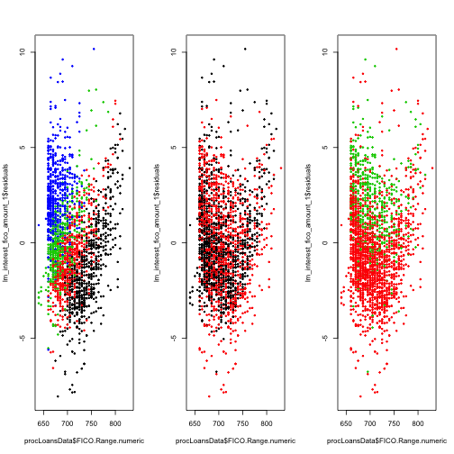 


some non-randomness on these residuals as well.

## Linear model 2. interest rate is outcome and FICO + Loan length are covariates

now try the same analysis using loan length instead of amount requested. loan length is a factor and not numeric as it was the previous covariate


```r
lm_interest_fico_length_1 <- lm(procLoansData$Interest.Rate.numeric ~ procLoansData$FICO.Range.numeric + 
    procLoansData$Loan.Length)
# see how it works with interaction between covariates
lm_interest_fico_length_2 <- lm(procLoansData$Interest.Rate.numeric ~ procLoansData$FICO.Range.numeric + 
    procLoansData$Loan.Length + procLoansData$FICO.Range.numeric * procLoansData$Loan.Length)

# use this plot as reference so we can add fitted lines on top
par(mfrow = c(1, 1))
plot(jitter(procLoansData$FICO.Range.numeric), jitter(procLoansData$Interest.Rate.numeric), 
    col = cut2(procLoansData$Amount.Requested, g = 2), pch = 20, cex = 0.6)
abline(lm_interest_fico, col = "black")

# plot fitted lines and show summaries
abline(lm_interest_fico_length_1, col = "#FF6633")
```

```
## Warning: only using the first two of 3 regression coefficients
```

```r
abline(lm_interest_fico_length_2, col = "#66FF33")
```

```
## Warning: only using the first two of 4 regression coefficients
```

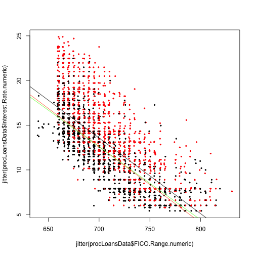 

```r

summary(lm_interest_fico_length_1)
```

```
## 
## Call:
## lm(formula = procLoansData$Interest.Rate.numeric ~ procLoansData$FICO.Range.numeric + 
##     procLoansData$Loan.Length)
## 
## Residuals:
##     Min      1Q  Median      3Q     Max 
## -11.406  -1.675  -0.219   1.417   9.424 
## 
## Coefficients:
##                                    Estimate Std. Error t value Pr(>|t|)
## (Intercept)                        72.34395    0.94048    76.9   <2e-16
## procLoansData$FICO.Range.numeric   -0.08533    0.00133   -64.1   <2e-16
## procLoansData$Loan.Length60 months  4.36655    0.11251    38.8   <2e-16
##                                       
## (Intercept)                        ***
## procLoansData$FICO.Range.numeric   ***
## procLoansData$Loan.Length60 months ***
## ---
## Signif. codes:  0 '***' 0.001 '**' 0.01 '*' 0.05 '.' 0.1 ' ' 1 
## 
## Residual standard error: 2.33 on 2495 degrees of freedom
## Multiple R-squared: 0.69,	Adjusted R-squared: 0.69 
## F-statistic: 2.78e+03 on 2 and 2495 DF,  p-value: <2e-16
```

```r
summary(lm_interest_fico_length_2)
```

```
## 
## Call:
## lm(formula = procLoansData$Interest.Rate.numeric ~ procLoansData$FICO.Range.numeric + 
##     procLoansData$Loan.Length + procLoansData$FICO.Range.numeric * 
##     procLoansData$Loan.Length)
## 
## Residuals:
##     Min      1Q  Median      3Q     Max 
## -11.561  -1.647  -0.216   1.404   9.322 
## 
## Coefficients:
##                                                                     Estimate
## (Intercept)                                                         69.88156
## procLoansData$FICO.Range.numeric                                    -0.08184
## procLoansData$Loan.Length60 months                                  16.21539
## procLoansData$FICO.Range.numeric:procLoansData$Loan.Length60 months -0.01677
##                                                                     Std. Error
## (Intercept)                                                            1.05114
## procLoansData$FICO.Range.numeric                                       0.00149
## procLoansData$Loan.Length60 months                                     2.30703
## procLoansData$FICO.Range.numeric:procLoansData$Loan.Length60 months    0.00326
##                                                                     t value
## (Intercept)                                                           66.48
## procLoansData$FICO.Range.numeric                                     -55.01
## procLoansData$Loan.Length60 months                                     7.03
## procLoansData$FICO.Range.numeric:procLoansData$Loan.Length60 months   -5.14
##                                                                     Pr(>|t|)
## (Intercept)                                                          < 2e-16
## procLoansData$FICO.Range.numeric                                     < 2e-16
## procLoansData$Loan.Length60 months                                   2.7e-12
## procLoansData$FICO.Range.numeric:procLoansData$Loan.Length60 months  2.9e-07
##                                                                        
## (Intercept)                                                         ***
## procLoansData$FICO.Range.numeric                                    ***
## procLoansData$Loan.Length60 months                                  ***
## procLoansData$FICO.Range.numeric:procLoansData$Loan.Length60 months ***
## ---
## Signif. codes:  0 '***' 0.001 '**' 0.01 '*' 0.05 '.' 0.1 ' ' 1 
## 
## Residual standard error: 2.32 on 2494 degrees of freedom
## Multiple R-squared: 0.693,	Adjusted R-squared: 0.693 
## F-statistic: 1.88e+03 on 3 and 2494 DF,  p-value: <2e-16
```


also in this case there is a significant relationship between covariates

adding interaction between covariates has little effect on slope and intercept, we can ignore model2. 

now plot the residuals


```r
par(mfrow = c(1, 3))
plot(procLoansData$FICO.Range.numeric, lm_interest_fico_length_1$residuals, 
    col = cut2(procLoansData$Interest.Rate.numeric, g = 4), pch = 20, cex = 0.6)
plot(procLoansData$FICO.Range.numeric, lm_interest_fico_length_1$residuals, 
    col = cut2(procLoansData$Amount.Requested, g = 2), pch = 20, cex = 0.6)
plot(procLoansData$FICO.Range.numeric, lm_interest_fico_length_1$residuals, 
    col = procLoansData$Loan.Length, pch = 20, cex = 0.6)
```

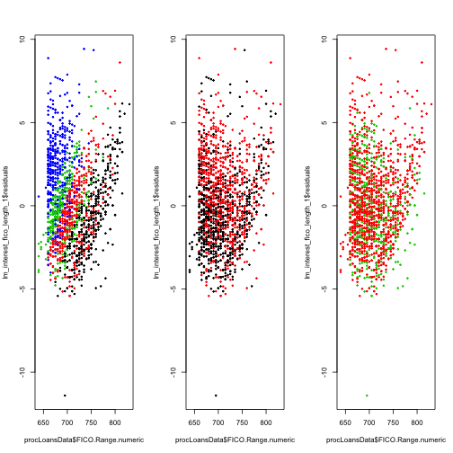 


## Final model


```r
lm_final <- lm(procLoansData$Interest.Rate.numeric ~ procLoansData$FICO.Range.numeric + 
    procLoansData$Amount.Requested + procLoansData$Loan.Length)

par(mfrow = c(1, 2))
plot(procLoansData$FICO.Range.numeric, lm_final$residuals, col = cut2(procLoansData$Amount.Requested, 
    g = 2), pch = 20, cex = 0.6)
plot(procLoansData$FICO.Range.numeric, lm_final$residuals, col = procLoansData$Loan.Length, 
    pch = 20, cex = 0.6)
```

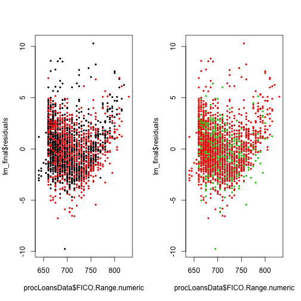 

```r

summary(lm_final)
```

```
## 
## Call:
## lm(formula = procLoansData$Interest.Rate.numeric ~ procLoansData$FICO.Range.numeric + 
##     procLoansData$Amount.Requested + procLoansData$Loan.Length)
## 
## Residuals:
##    Min     1Q Median     3Q    Max 
## -9.761 -1.457 -0.132  1.262 10.295 
## 
## Coefficients:
##                                     Estimate Std. Error t value Pr(>|t|)
## (Intercept)                         7.26e+01   8.53e-01    85.1   <2e-16
## procLoansData$FICO.Range.numeric   -8.77e-02   1.21e-03   -72.4   <2e-16
## procLoansData$Amount.Requested      1.39e-04   5.96e-06    23.2   <2e-16
## procLoansData$Loan.Length60 months  3.29e+00   1.12e-01    29.4   <2e-16
##                                       
## (Intercept)                        ***
## procLoansData$FICO.Range.numeric   ***
## procLoansData$Amount.Requested     ***
## procLoansData$Loan.Length60 months ***
## ---
## Signif. codes:  0 '***' 0.001 '**' 0.01 '*' 0.05 '.' 0.1 ' ' 1 
## 
## Residual standard error: 2.11 on 2494 degrees of freedom
## Multiple R-squared: 0.745,	Adjusted R-squared: 0.745 
## F-statistic: 2.43e+03 on 3 and 2494 DF,  p-value: <2e-16
```

```r
confint(lm_final)
```

```
##                                         2.5 %     97.5 %
## (Intercept)                        70.8908718 74.2362290
## procLoansData$FICO.Range.numeric   -0.0901192 -0.0853685
## procLoansData$Amount.Requested      0.0001268  0.0001502
## procLoansData$Loan.Length60 months  3.0732012  3.5125398
```


create the final image

```r
par(mfrow = c(1, 3))
plot(jitter(procLoansData$FICO.Range.numeric), jitter(procLoansData$Interest.Rate.numeric), 
    col = procLoansData$Loan.Length, pch = 20, cex = 0.6, xlab = "FICO score (numeric)", 
    ylab = "Interest Rate (%)")
legend(750, 23, legend = unique(procLoansData$Loan.Length), col = unique(procLoansData$Loan.Length), 
    pch = 20, cex = 0.7)
plot(procLoansData$FICO.Range.numeric, lm_interest_fico$residuals, col = procLoansData$Loan.Length, 
    pch = 20, cex = 0.7, xlab = "FICO score (numeric)", ylab = "No Adjustement Residuals")
plot(procLoansData$FICO.Range.numeric, lm_final$residuals, col = procLoansData$Loan.Length, 
    pch = 20, cex = 0.7, xlab = "FICO score (numeric)", ylab = "Full Model Residuals")
```

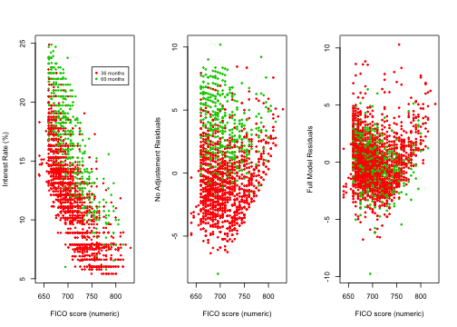 

```r
dev.copy2pdf(file = "../../figures/final.pdf")
```

```
## pdf 
##   2
```


# Conclusions

## check list

Item 1 - Write-up
* Does the analysis have an introduction, methods, analysis, and conclusions?
* Are figures labeled and referred to by number in the text?
* Is the analysis written in clear and understandable English?
* Are the names of variables reported in plain language, rather than in coded names?
* Does the analysis report the number of samples?
* Does the analysis report any missing data or other unusual features?
* Does the analysis include a discussion of potential confounders?
* Are the statistical models appropriately applied?
* Are estimates reported with appropriate units and measures of uncertainty?
* Are estimators/predictions appropriately interpreted?
* Does the analysis make concrete conclusions?
* Does the analysis specify potential problems with the conclusions?

Item 2 - Figure and caption
* Is the figure caption descriptive enough to stand alone?
* Does the figure focus on a key issue in the processing/modeling of the data?
* Are axes labeled and are the labels large enough to read?

Item 3 - References
* Does the analysis include references for the statistical methods used?

Item 4 - R script
* Can the analysis be reproduced with the code provided?
