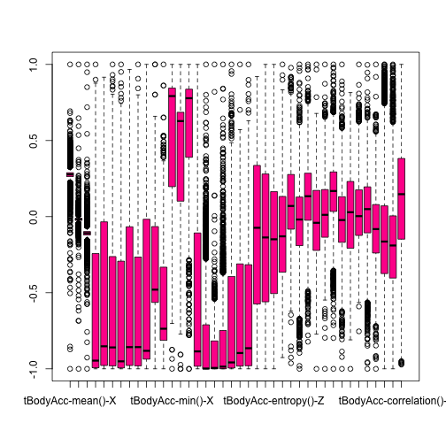
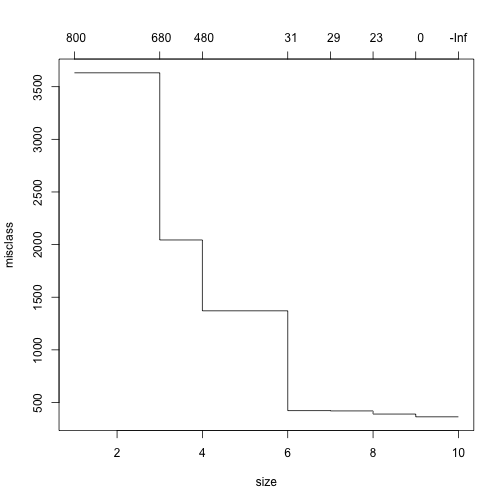

2nd Assignment
========================================================

Todo
--------------------------------------------------------
Your task is to build a function that predicts what activity a subject is performing based on the quantitative measurements from the Samsung phone. For this analysis your training set must include the data from subjects 1, 3, 5, and 6.  But you may use more subjects data to train if you wish. Your test set is the data from subjects 27, 28, 29, and 30, but you may use more data to test. Be careful that your training/test sets do not overlap. 

Introduction
--------------------------------------------------------
Research in activity and gesture recognition is quite important nowadays [ref. 3], as it can help in several different fields, such as video surveillance, health, disease prevention and much more. Since the introduction of smartphones, and most importantly the accelerometers mounted in the devices, along with their wide adoption across all countries, plenty of data describing different gestures has become availble. This data can be used proficiently to monitor and predict activities of people carrying the device, to help them expoiting the goals fixed by a specific application that takes advantage of these values. As a matter of fact, a simplified version of the predictor described in this paper has been used to teach first aid techniques in a project financed by the Technology Strategy Board and lead by the Resuscitation Council in the UK [ref. 7].
In this paper we will show how a set of data can be used to train models and predict what activity is performed by a user producing comparable values through an accelerometer mounted on a mobile device.

Data collection
--------------------------------------------------------
The experiments have been carried out with a group of 30 volunteers within an age bracket of 19-48 years. Each person performed six activities (WALKING, WALKING UPSTAIRS, WALKING DOWNSTAIRS, SITTING, STANDING, LAYING) wearing a smartphone (Samsung Galaxy S II) on the waist. Using its embedded accelerometer and gyroscope, we captured 3-axial linear acceleration and 3-axial angular velocity at a constant rate of 50Hz. The experiments have been video-recorded to label the data manually. The obtained dataset has been randomly partitioned into two sets, where 70% of the volunteers was selected for generating the training data and 30% the test data. [ref. 1]

All of the columns of the data set (except the last two) represents one measurement from the Samsung phone. The variable subject indicates which subject was performing the tasks when the measurements were taken. The variable activity tells what activity they were performing. [ref. 2]


```r

# uncomment to download it again data_url <-
# 'https://spark-public.s3.amazonaws.com/dataanalysis/samsungData.rda'
# download.file(data_url, '../data/samsungData.rda', method='curl')

# show date for the records download_when <- date() print(download_when)

# the file available here was downloaded on Fri Mar 8th, at 11:16 AM
load("../data/samsungData.rda")
```


Exploratory analysis
--------------------------------------------------------
Great help has been provided by the community in the initial approach to understanding how the acceleramoter data is structured, through a discussion around differences between total body acceleration, gravity, jerk and all related elements [ref. 4].


```r
names(samsungData)[1:40]
```

```
##  [1] "tBodyAcc-mean()-X"          "tBodyAcc-mean()-Y"         
##  [3] "tBodyAcc-mean()-Z"          "tBodyAcc-std()-X"          
##  [5] "tBodyAcc-std()-Y"           "tBodyAcc-std()-Z"          
##  [7] "tBodyAcc-mad()-X"           "tBodyAcc-mad()-Y"          
##  [9] "tBodyAcc-mad()-Z"           "tBodyAcc-max()-X"          
## [11] "tBodyAcc-max()-Y"           "tBodyAcc-max()-Z"          
## [13] "tBodyAcc-min()-X"           "tBodyAcc-min()-Y"          
## [15] "tBodyAcc-min()-Z"           "tBodyAcc-sma()"            
## [17] "tBodyAcc-energy()-X"        "tBodyAcc-energy()-Y"       
## [19] "tBodyAcc-energy()-Z"        "tBodyAcc-iqr()-X"          
## [21] "tBodyAcc-iqr()-Y"           "tBodyAcc-iqr()-Z"          
## [23] "tBodyAcc-entropy()-X"       "tBodyAcc-entropy()-Y"      
## [25] "tBodyAcc-entropy()-Z"       "tBodyAcc-arCoeff()-X,1"    
## [27] "tBodyAcc-arCoeff()-X,2"     "tBodyAcc-arCoeff()-X,3"    
## [29] "tBodyAcc-arCoeff()-X,4"     "tBodyAcc-arCoeff()-Y,1"    
## [31] "tBodyAcc-arCoeff()-Y,2"     "tBodyAcc-arCoeff()-Y,3"    
## [33] "tBodyAcc-arCoeff()-Y,4"     "tBodyAcc-arCoeff()-Z,1"    
## [35] "tBodyAcc-arCoeff()-Z,2"     "tBodyAcc-arCoeff()-Z,3"    
## [37] "tBodyAcc-arCoeff()-Z,4"     "tBodyAcc-correlation()-X,Y"
## [39] "tBodyAcc-correlation()-X,Z" "tBodyAcc-correlation()-Y,Z"
```

```r
names(samsungData)[41:80]
```

```
##  [1] "tGravityAcc-mean()-X"          "tGravityAcc-mean()-Y"         
##  [3] "tGravityAcc-mean()-Z"          "tGravityAcc-std()-X"          
##  [5] "tGravityAcc-std()-Y"           "tGravityAcc-std()-Z"          
##  [7] "tGravityAcc-mad()-X"           "tGravityAcc-mad()-Y"          
##  [9] "tGravityAcc-mad()-Z"           "tGravityAcc-max()-X"          
## [11] "tGravityAcc-max()-Y"           "tGravityAcc-max()-Z"          
## [13] "tGravityAcc-min()-X"           "tGravityAcc-min()-Y"          
## [15] "tGravityAcc-min()-Z"           "tGravityAcc-sma()"            
## [17] "tGravityAcc-energy()-X"        "tGravityAcc-energy()-Y"       
## [19] "tGravityAcc-energy()-Z"        "tGravityAcc-iqr()-X"          
## [21] "tGravityAcc-iqr()-Y"           "tGravityAcc-iqr()-Z"          
## [23] "tGravityAcc-entropy()-X"       "tGravityAcc-entropy()-Y"      
## [25] "tGravityAcc-entropy()-Z"       "tGravityAcc-arCoeff()-X,1"    
## [27] "tGravityAcc-arCoeff()-X,2"     "tGravityAcc-arCoeff()-X,3"    
## [29] "tGravityAcc-arCoeff()-X,4"     "tGravityAcc-arCoeff()-Y,1"    
## [31] "tGravityAcc-arCoeff()-Y,2"     "tGravityAcc-arCoeff()-Y,3"    
## [33] "tGravityAcc-arCoeff()-Y,4"     "tGravityAcc-arCoeff()-Z,1"    
## [35] "tGravityAcc-arCoeff()-Z,2"     "tGravityAcc-arCoeff()-Z,3"    
## [37] "tGravityAcc-arCoeff()-Z,4"     "tGravityAcc-correlation()-X,Y"
## [39] "tGravityAcc-correlation()-X,Z" "tGravityAcc-correlation()-Y,Z"
```

```r
names(samsungData)[81:120]
```

```
##  [1] "tBodyAccJerk-mean()-X"          "tBodyAccJerk-mean()-Y"         
##  [3] "tBodyAccJerk-mean()-Z"          "tBodyAccJerk-std()-X"          
##  [5] "tBodyAccJerk-std()-Y"           "tBodyAccJerk-std()-Z"          
##  [7] "tBodyAccJerk-mad()-X"           "tBodyAccJerk-mad()-Y"          
##  [9] "tBodyAccJerk-mad()-Z"           "tBodyAccJerk-max()-X"          
## [11] "tBodyAccJerk-max()-Y"           "tBodyAccJerk-max()-Z"          
## [13] "tBodyAccJerk-min()-X"           "tBodyAccJerk-min()-Y"          
## [15] "tBodyAccJerk-min()-Z"           "tBodyAccJerk-sma()"            
## [17] "tBodyAccJerk-energy()-X"        "tBodyAccJerk-energy()-Y"       
## [19] "tBodyAccJerk-energy()-Z"        "tBodyAccJerk-iqr()-X"          
## [21] "tBodyAccJerk-iqr()-Y"           "tBodyAccJerk-iqr()-Z"          
## [23] "tBodyAccJerk-entropy()-X"       "tBodyAccJerk-entropy()-Y"      
## [25] "tBodyAccJerk-entropy()-Z"       "tBodyAccJerk-arCoeff()-X,1"    
## [27] "tBodyAccJerk-arCoeff()-X,2"     "tBodyAccJerk-arCoeff()-X,3"    
## [29] "tBodyAccJerk-arCoeff()-X,4"     "tBodyAccJerk-arCoeff()-Y,1"    
## [31] "tBodyAccJerk-arCoeff()-Y,2"     "tBodyAccJerk-arCoeff()-Y,3"    
## [33] "tBodyAccJerk-arCoeff()-Y,4"     "tBodyAccJerk-arCoeff()-Z,1"    
## [35] "tBodyAccJerk-arCoeff()-Z,2"     "tBodyAccJerk-arCoeff()-Z,3"    
## [37] "tBodyAccJerk-arCoeff()-Z,4"     "tBodyAccJerk-correlation()-X,Y"
## [39] "tBodyAccJerk-correlation()-X,Z" "tBodyAccJerk-correlation()-Y,Z"
```

```r

table(samsungData$activity)
```

```
## 
##   laying  sitting standing     walk walkdown   walkup 
##     1407     1286     1374     1226      986     1073
```

```r
class(samsungData$activity)
```

```
## [1] "character"
```

```r

table(samsungData$subject)
```

```
## 
##   1   3   5   6   7   8  11  14  15  16  17  19  21  22  23  25  26  27 
## 347 341 302 325 308 281 316 323 328 366 368 360 408 321 372 409 392 376 
##  28  29  30 
## 382 344 383
```

```r
dim(table(samsungData$subject))
```

```
## [1] 21
```


* 1st 40 columns contain data related to body acceleration along the 3 axes, this is taking into account the gravity vector
* columns 41-80 contain data related to gravity acceleration only along the 3 axes
* columns 81-120 contain data related to acceleration jerk for the body along the 3 axes (jerk is 3rd order derivative of position, equals 2nd order derivative of velocity, 1st order derivative of acceleration [ref. 5])
* further exploration shows that: columns 121-160 contain body gyroscope, 161-200 body gyroscope jerk, and up to column 265 other derivatives in the time domain, while from column 266 to column 554 the values transformed in the frequency domain, then columns 556 to 561 for the angles between accelerometer vectors and the last two columns dedicated to subject and activity labelings
* table of activities show how they are equally distributed across 6 items: laying, sitting, standing, walk, walkdown, walkup
* table of subjects show how they are equally distributed across 21 people, for the purpose of this analysis, we are going to use subjects labeled 1, 3, 5, 6 for training sets and subjects 27, 28, 29, and 30 for tests.


```r
summary(samsungData[1:40])
```

```
##  tBodyAcc-mean()-X tBodyAcc-mean()-Y tBodyAcc-mean()-Z tBodyAcc-std()-X
##  Min.   :-1.000    Min.   :-1.0000   Min.   :-1.0000   Min.   :-1.000  
##  1st Qu.: 0.263    1st Qu.:-0.0249   1st Qu.:-0.1210   1st Qu.:-0.993  
##  Median : 0.277    Median :-0.0172   Median :-0.1087   Median :-0.946  
##  Mean   : 0.275    Mean   :-0.0177   Mean   :-0.1091   Mean   :-0.605  
##  3rd Qu.: 0.288    3rd Qu.:-0.0108   3rd Qu.:-0.0978   3rd Qu.:-0.243  
##  Max.   : 1.000    Max.   : 1.0000   Max.   : 1.0000   Max.   : 1.000  
##  tBodyAcc-std()-Y  tBodyAcc-std()-Z tBodyAcc-mad()-X tBodyAcc-mad()-Y 
##  Min.   :-0.9999   Min.   :-1.000   Min.   :-1.000   Min.   :-1.0000  
##  1st Qu.:-0.9781   1st Qu.:-0.980   1st Qu.:-0.994   1st Qu.:-0.9782  
##  Median :-0.8519   Median :-0.859   Median :-0.951   Median :-0.8573  
##  Mean   :-0.5109   Mean   :-0.605   Mean   :-0.630   Mean   :-0.5269  
##  3rd Qu.:-0.0342   3rd Qu.:-0.262   3rd Qu.:-0.293   3rd Qu.:-0.0667  
##  Max.   : 0.9162   Max.   : 1.000   Max.   : 1.000   Max.   : 0.9677  
##  tBodyAcc-mad()-Z tBodyAcc-max()-X  tBodyAcc-max()-Y  tBodyAcc-max()-Z
##  Min.   :-1.000   Min.   :-1.0000   Min.   :-1.0000   Min.   :-1.000  
##  1st Qu.:-0.980   1st Qu.:-0.9362   1st Qu.:-0.5636   1st Qu.:-0.813  
##  Median :-0.857   Median :-0.8816   Median :-0.4797   Median :-0.737  
##  Mean   :-0.606   Mean   :-0.4686   Mean   :-0.3060   Mean   :-0.557  
##  3rd Qu.:-0.266   3rd Qu.:-0.0171   3rd Qu.:-0.0654   3rd Qu.:-0.332  
##  Max.   : 1.000   Max.   : 1.0000   Max.   : 1.0000   Max.   : 1.000  
##  tBodyAcc-min()-X tBodyAcc-min()-Y tBodyAcc-min()-Z tBodyAcc-sma()  
##  Min.   :-1.000   Min.   :-1.000   Min.   :-1.000   Min.   :-1.000  
##  1st Qu.: 0.197   1st Qu.: 0.102   1st Qu.: 0.390   1st Qu.:-0.983  
##  Median : 0.792   Median : 0.628   Median : 0.778   Median :-0.885  
##  Mean   : 0.524   Mean   : 0.387   Mean   : 0.594   Mean   :-0.548  
##  3rd Qu.: 0.844   3rd Qu.: 0.686   3rd Qu.: 0.837   3rd Qu.:-0.107  
##  Max.   : 1.000   Max.   : 1.000   Max.   : 1.000   Max.   : 1.000  
##  tBodyAcc-energy()-X tBodyAcc-energy()-Y tBodyAcc-energy()-Z
##  Min.   :-1.000      Min.   :-1.000      Min.   :-1.000     
##  1st Qu.:-1.000      1st Qu.:-1.000      1st Qu.:-1.000     
##  Median :-0.998      Median :-0.994      Median :-0.986     
##  Mean   :-0.820      Mean   :-0.902      Mean   :-0.846     
##  3rd Qu.:-0.711      3rd Qu.:-0.817      3rd Qu.:-0.748     
##  Max.   : 1.000      Max.   : 1.000      Max.   : 1.000     
##  tBodyAcc-iqr()-X tBodyAcc-iqr()-Y tBodyAcc-iqr()-Z tBodyAcc-entropy()-X
##  Min.   :-1.000   Min.   :-1.000   Min.   :-1.000   Min.   :-1.0000     
##  1st Qu.:-0.994   1st Qu.:-0.982   1st Qu.:-0.980   1st Qu.:-0.5734     
##  Median :-0.958   Median :-0.896   Median :-0.865   Median :-0.0734     
##  Mean   :-0.684   Mean   :-0.644   Mean   :-0.631   Mean   :-0.1030     
##  3rd Qu.:-0.393   3rd Qu.:-0.310   3rd Qu.:-0.316   3rd Qu.: 0.3365     
##  Max.   : 1.000   Max.   : 1.000   Max.   : 1.000   Max.   : 0.9197     
##  tBodyAcc-entropy()-Y tBodyAcc-entropy()-Z tBodyAcc-arCoeff()-X,1
##  Min.   :-1.000       Min.   :-1.000       Min.   :-0.926        
##  1st Qu.:-0.560       1st Qu.:-0.505       1st Qu.:-0.365        
##  Median :-0.137       Median :-0.149       Median :-0.129        
##  Mean   :-0.138       Mean   :-0.164       Mean   :-0.117        
##  3rd Qu.: 0.280       3rd Qu.: 0.164       3rd Qu.: 0.133        
##  Max.   : 1.000       Max.   : 1.000       Max.   : 1.000        
##  tBodyAcc-arCoeff()-X,2 tBodyAcc-arCoeff()-X,3 tBodyAcc-arCoeff()-X,4
##  Min.   :-0.9631        Min.   :-1.0000        Min.   :-0.8221       
##  1st Qu.:-0.0825        1st Qu.:-0.1906        1st Qu.:-0.0239       
##  Median : 0.0701        Median :-0.0190        Median : 0.1341       
##  Mean   : 0.1028        Mean   :-0.0378        Mean   : 0.1305       
##  3rd Qu.: 0.2769        3rd Qu.: 0.1286        3rd Qu.: 0.2853       
##  Max.   : 0.9784        Max.   : 1.0000        Max.   : 1.0000       
##  tBodyAcc-arCoeff()-Y,1 tBodyAcc-arCoeff()-Y,2 tBodyAcc-arCoeff()-Y,3
##  Min.   :-1.0000        Min.   :-1.0000        Min.   :-1.0000       
##  1st Qu.:-0.2219        1st Qu.:-0.1354        1st Qu.: 0.0344       
##  Median :-0.0407        Median : 0.0117        Median : 0.1684       
##  Mean   :-0.0262        Mean   : 0.0263        Mean   : 0.1600       
##  3rd Qu.: 0.1723        3rd Qu.: 0.1778        3rd Qu.: 0.2934       
##  Max.   : 1.0000        Max.   : 1.0000        Max.   : 1.0000       
##  tBodyAcc-arCoeff()-Y,4 tBodyAcc-arCoeff()-Z,1 tBodyAcc-arCoeff()-Z,2
##  Min.   :-1.0000        Min.   :-1.0000        Min.   :-0.7538       
##  1st Qu.:-0.1688        1st Qu.:-0.2073        1st Qu.:-0.1235       
##  Median :-0.0224        Median : 0.0290        Median : 0.0033       
##  Mean   :-0.0196        Mean   : 0.0094        Mean   : 0.0333       
##  3rd Qu.: 0.1309        3rd Qu.: 0.2310        3rd Qu.: 0.1756       
##  Max.   : 1.0000        Max.   : 0.8146        Max.   : 1.0000       
##  tBodyAcc-arCoeff()-Z,3 tBodyAcc-arCoeff()-Z,4 tBodyAcc-correlation()-X,Y
##  Min.   :-1.0000        Min.   :-1.0000        Min.   :-1.0000           
##  1st Qu.:-0.1065        1st Qu.:-0.2389        1st Qu.:-0.3739           
##  Median : 0.0494        Median :-0.0819        Median :-0.1637           
##  Mean   : 0.0366        Mean   :-0.0786        Mean   :-0.1251           
##  3rd Qu.: 0.1956        3rd Qu.: 0.0792        3rd Qu.: 0.0708           
##  Max.   : 0.9972        Max.   : 1.0000        Max.   : 1.0000           
##  tBodyAcc-correlation()-X,Z tBodyAcc-correlation()-Y,Z
##  Min.   :-1.0000            Min.   :-0.972            
##  1st Qu.:-0.4035            1st Qu.:-0.148            
##  Median :-0.1897            Median : 0.147            
##  Mean   :-0.1938            Mean   : 0.105            
##  3rd Qu.: 0.0052            3rd Qu.: 0.382            
##  Max.   : 1.0000            Max.   : 1.000
```

```r
boxplot(samsungData[1:40], col = "#ff0099")
```

 


a quick observation of the 1st 40 columns reveals that there are not empty values in the dataset, and a boxplot shows that they are all normalized in a [-1,1] interval, so it should not need removal of outliers. the same applies the all numeric values contained in the dataset.
Calling the summary function also reveals that reserved R keywords are used for variable names, so to stay on a safe side, when creating the training and test set, they will be converted using R function make.names.

The activity field has been stored as character so it will be converted to factor in the training/validation/test sets.


```r
# transforming a bit the samsungData so as to cleanup names
samsung_procdata <- data.frame(samsungData, check.names = TRUE)
samsung_procdata$activity <- as.factor(samsung_procdata$activity)

# preparing the training set
training_subjects <- c(1, 3, 5, 6)
training_set <- samsung_procdata[samsung_procdata$subject %in% training_subjects, 
    ]
training_set <- training_set[order(training_set$activity), ]
training_set$subject <- NULL

factor_activity <- unique(training_set$activity)

# enlarged dataset, we are using the %in% to avoid the warning: longer
# object length is not a multiple of shorter object length
ltraining_subjects <- c(1, 3, 5, 6, 7, 8, 11, 19, 21, 22, 23, 25, 26)
ltraining_set <- samsung_procdata[samsung_procdata$subject %in% ltraining_subjects, 
    ]
ltraining_set <- ltraining_set[order(ltraining_set$activity), ]
ltraining_set$subject <- NULL

# pick a few subjects for validation set
validation_subjects <- c(14, 15, 16, 17)
validation_set <- samsung_procdata[samsung_procdata$subject %in% validation_subjects, 
    ]
validation_set <- validation_set[order(validation_set$activity), ]
validation_set$subject <- NULL

# doing the same for test set
test_subjects <- c(27, 28, 29, 30)
test_set <- samsung_procdata[samsung_procdata$subject %in% test_subjects, ]
test_set <- test_set[order(test_set$activity), ]
test_set$subject <- NULL
```


We subset the whole dataframe for training, validation and tests with the subjects we want to use, then ordering by activity, cleaning up variable names and removing the column related to subjects since we don't want it to appear in the model. Dimensions of the sets are:


```r
dim(training_set)
```

```
## [1] 1315  562
```

```r
dim(ltraining_set)
```

```
## [1] 4482  562
```

```r
dim(validation_set)
```

```
## [1] 1385  562
```

```r
dim(test_set)
```

```
## [1] 1485  562
```


(we also create an extended training set made of 5867 observations to validate our models without bootstrap) All the observations are consistently made of 562 variables.

Statistical modeling
--------------------------------------------------------

We are going to use the data from subjects 1,3,5,6 as training sets to create a range of regression models, using a mixture of kernel based functions (i.e. using trees, randomForests and support vector machines) taking extra care in balancing the bias / variance trade off in statistical modeling, as described in the analysis section of this paper. Particularly, given the nature of this dataset, differences in errors will be evaulated when using bootstrap techniques in favour of enlarging the dataset and creating models without sampling. A complete recap of statistical methods (regression models and bootstrap technique) mentioned in this paper can be found in [ref. 6]

Analysis
--------------------------------------------------------

After plotting values from the training set, we can see clear clusters of activities: these plots show comparable patterns no matter the variable chosen for the y-axis [fig. 1a], indicating that it is worth creating a regression model that uses all the variables in the data set, we will then proceed with further exploration in order to reduce the complexity of our models.
We load the required libraries and set a seed so as to generate a consistent set of training models, so that errors on validation and test will be always consistent.


```r
library(randomForest)
```

```
## randomForest 4.6-7
```

```
## Type rfNews() to see new features/changes/bug fixes.
```

```r
library(e1071)
```

```
## Loading required package: class
```

```r
library(tree)

set.seed(987654321)
```


We start creating 3 different models using the basic training set: tree, random forest and svm.


```r
mod_randomforest <- randomForest(activity ~ ., data = training_set, prox = TRUE)
mod_svm <- svm(activity ~ ., data = training_set)
mod_tree <- tree(activity ~ ., data = training_set)

print(mod_randomforest)
```

```
## 
## Call:
##  randomForest(formula = activity ~ ., data = training_set, prox = TRUE) 
##                Type of random forest: classification
##                      Number of trees: 500
## No. of variables tried at each split: 23
## 
##         OOB estimate of  error rate: 0.61%
## Confusion matrix:
##          laying sitting standing walk walkdown walkup class.error
## laying      220       0        0    0        0      1    0.004525
## sitting       0     196        2    0        0      0    0.010101
## standing      0       1      226    0        0      0    0.004405
## walk          0       0        0  264        1      1    0.007519
## walkdown      0       0        0    0      192      1    0.005181
## walkup        0       0        0    0        1    209    0.004762
```

```r
print(mod_svm)
```

```
## 
## Call:
## svm(formula = activity ~ ., data = training_set)
## 
## 
## Parameters:
##    SVM-Type:  C-classification 
##  SVM-Kernel:  radial 
##        cost:  1 
##       gamma:  0.001783 
## 
## Number of Support Vectors:  704
```

```r
print(mod_tree)
```

```
## node), split, n, deviance, yval, (yprob)
##       * denotes terminal node
## 
##  1) root 1315 5000 walk ( 0.168 0.151 0.173 0.202 0.147 0.160 )  
##    2) tBodyAcc.max...X < -0.552285 646 1000 standing ( 0.342 0.307 0.351 0.000 0.000 0.000 )  
##      4) tGravityAcc.mean...X < 0.30742 221    0 laying ( 1.000 0.000 0.000 0.000 0.000 0.000 ) *
##      5) tGravityAcc.mean...X > 0.30742 425  600 standing ( 0.000 0.466 0.534 0.000 0.000 0.000 )  
##       10) tGravityAcc.max...Y < -0.013075 266  200 standing ( 0.000 0.147 0.853 0.000 0.000 0.000 )  
##         20) tGravityAcc.mean...Y < -0.124436 173    0 standing ( 0.000 0.000 1.000 0.000 0.000 0.000 ) *
##         21) tGravityAcc.mean...Y > -0.124436 93  100 standing ( 0.000 0.419 0.581 0.000 0.000 0.000 )  
##           42) tGravityAcc.mean...Z < 0.0286027 29    0 sitting ( 0.000 1.000 0.000 0.000 0.000 0.000 ) *
##           43) tGravityAcc.mean...Z > 0.0286027 64   60 standing ( 0.000 0.156 0.844 0.000 0.000 0.000 ) *
##       11) tGravityAcc.max...Y > -0.013075 159    0 sitting ( 0.000 1.000 0.000 0.000 0.000 0.000 ) *
##    3) tBodyAcc.max...X > -0.552285 669 1000 walk ( 0.000 0.000 0.000 0.398 0.288 0.314 )  
##      6) tGravityAcc.min...Y < -0.297541 180   60 walkup ( 0.000 0.000 0.000 0.017 0.017 0.967 )  
##       12) fBodyAccJerk.bandsEnergy...17.32 < -0.536357 174    0 walkup ( 0.000 0.000 0.000 0.000 0.000 1.000 ) *
##       13) fBodyAccJerk.bandsEnergy...17.32 > -0.536357 6    8 walk ( 0.000 0.000 0.000 0.500 0.500 0.000 ) *
##      7) tGravityAcc.min...Y > -0.297541 489  900 walk ( 0.000 0.000 0.000 0.538 0.389 0.074 )  
##       14) fBodyAccMag.std.. < -0.329573 271  100 walk ( 0.000 0.000 0.000 0.945 0.026 0.030 )  
##         28) fBodyAcc.bandsEnergy...17.24.1 < -0.808123 13   20 walkup ( 0.000 0.000 0.000 0.231 0.154 0.615 ) *
##         29) fBodyAcc.bandsEnergy...17.24.1 > -0.808123 258   50 walk ( 0.000 0.000 0.000 0.981 0.019 0.000 ) *
##       15) fBodyAccMag.std.. > -0.329573 218  200 walkdown ( 0.000 0.000 0.000 0.032 0.839 0.128 )  
##         30) tBodyAccJerk.max...X < -0.443322 23    8 walkup ( 0.000 0.000 0.000 0.043 0.000 0.957 ) *
##         31) tBodyAccJerk.max...X > -0.443322 195  100 walkdown ( 0.000 0.000 0.000 0.031 0.938 0.031 )  
##           62) tBodyAcc.max...X < 0.0718084 7    8 walk ( 0.000 0.000 0.000 0.714 0.000 0.286 ) *
##           63) tBodyAcc.max...X > 0.0718084 188   50 walkdown ( 0.000 0.000 0.000 0.005 0.973 0.021 ) *
```


Random forest with 500 trees with bootstrap shows an error < 4% in activity classification, while tree splits show that first variables used are all in the time domain. Now we can do some prediction on the validation test to see how the models behave.


```r
predvalid_randomforest <- predict(mod_randomforest, validation_set)
predvalid_svm <- predict(mod_svm, validation_set)
predvalid_tree <- predict(mod_tree, validation_set, type = "class")

errvalid_randomforest <- sum(predvalid_randomforest != validation_set$activity)/length(validation_set$activity)
print(errvalid_randomforest)
```

```
## [1] 0.1581
```

```r

errvalid_svm <- sum(predvalid_svm != validation_set$activity)/length(validation_set$activity)
print(errvalid_svm)
```

```
## [1] 0.213
```

```r

errvalid_tree <- sum(predvalid_tree != validation_set$activity)/length(validation_set$activity)
print(errvalid_tree)
```

```
## [1] 0.2014
```


We obtain 17% error using random forest, 25% using svm and 21% using trees. Given that a random forest training is natively executed using boostrap technique, it is reasonable to obtain a lower error and does not seem that the model is overfitting the data, returning a moderate error but still allowing a decent bias.

Larger errors using svm and tree are probably given by the nature of the reduced dataset, so in order to obtain values that are comparable to a random forest using bootstrap, we enlarge the training set using a greater number of subjects (in this case we have a training set made of 5867 observations of 562 variables) and we check the predictors again.


```r
mod_ltree <- tree(activity ~ ., data = ltraining_set)
print(mod_ltree)
```

```
## node), split, n, deviance, yval, (yprob)
##       * denotes terminal node
## 
##  1) root 4482 20000 laying ( 2e-01 2e-01 2e-01 2e-01 1e-01 1e-01 )  
##    2) fBodyAccJerk.bandsEnergy...1.8 < -0.986067 2446  5000 laying ( 3e-01 3e-01 3e-01 0e+00 0e+00 0e+00 )  
##      4) tGravityAcc.mean...X < 0.109006 849     0 laying ( 1e+00 0e+00 0e+00 0e+00 0e+00 0e+00 ) *
##      5) tGravityAcc.mean...X > 0.109006 1597  2000 standing ( 0e+00 5e-01 5e-01 0e+00 0e+00 0e+00 )  
##       10) tGravityAcc.max...Y < -0.0928764 742   100 standing ( 0e+00 1e-02 1e+00 0e+00 0e+00 0e+00 ) *
##       11) tGravityAcc.max...Y > -0.0928764 855   600 sitting ( 0e+00 9e-01 1e-01 0e+00 0e+00 0e+00 )  
##         22) tGravityAcc.mean...Y < 0.00668932 249   300 sitting ( 0e+00 6e-01 4e-01 0e+00 0e+00 0e+00 ) *
##         23) tGravityAcc.mean...Y > 0.00668932 606     0 sitting ( 0e+00 1e+00 0e+00 0e+00 0e+00 0e+00 ) *
##    3) fBodyAccJerk.bandsEnergy...1.8 > -0.986067 2036  4000 walk ( 5e-04 5e-04 0e+00 4e-01 3e-01 3e-01 )  
##      6) tBodyAccMag.std.. < -0.0303083 1499  3000 walk ( 0e+00 7e-04 0e+00 5e-01 8e-02 4e-01 )  
##       12) tGravityAcc.arCoeff...Z.1 < -0.44656 719   900 walkup ( 0e+00 1e-03 0e+00 1e-01 7e-02 8e-01 )  
##         24) tGravityAcc.min...Y < -0.143246 656   600 walkup ( 0e+00 0e+00 0e+00 1e-01 3e-02 9e-01 )  
##           48) tGravityAcc.arCoeff...X.1 < -0.496244 591   300 walkup ( 0e+00 0e+00 0e+00 3e-02 3e-02 9e-01 ) *
##           49) tGravityAcc.arCoeff...X.1 > -0.496244 65    80 walk ( 0e+00 0e+00 0e+00 7e-01 0e+00 3e-01 ) *
##         25) tGravityAcc.min...Y > -0.143246 63   100 walk ( 0e+00 2e-02 0e+00 5e-01 5e-01 0e+00 ) *
##       13) tGravityAcc.arCoeff...Z.1 > -0.44656 780   800 walk ( 0e+00 0e+00 0e+00 8e-01 8e-02 7e-02 )  
##         26) fBodyGyro.maxInds.X < -0.966667 71   100 walkdown ( 0e+00 0e+00 0e+00 1e-01 5e-01 4e-01 ) *
##         27) fBodyGyro.maxInds.X > -0.966667 709   500 walk ( 0e+00 0e+00 0e+00 9e-01 5e-02 4e-02 ) *
##      7) tBodyAccMag.std.. > -0.0303083 537   400 walkdown ( 2e-03 0e+00 0e+00 4e-02 9e-01 5e-02 ) *
```

```r

mod_lsvm <- svm(activity ~ ., data = ltraining_set)
print(mod_lsvm)
```

```
## 
## Call:
## svm(formula = activity ~ ., data = ltraining_set)
## 
## 
## Parameters:
##    SVM-Type:  C-classification 
##  SVM-Kernel:  radial 
##        cost:  1 
##       gamma:  0.001783 
## 
## Number of Support Vectors:  1631
```


Printing the tree now shows how the first split are done using a mixture of frequency, time and angle variables: this supports the idea that all variables contribute to the decision, no matter their specific domain. Now check predictions of the new models.


```r
predvalid_ltree <- predict(mod_ltree, validation_set, type = "class")
errvalid_ltree <- sum(predvalid_ltree != validation_set$activity)/length(validation_set$activity)
print(errvalid_ltree)
```

```
## [1] 0.2
```

```r

predvalid_lsvm <- predict(mod_lsvm, validation_set)
errvalid_lsvm <- sum(predvalid_lsvm != validation_set$activity)/length(validation_set$activity)
print(errvalid_lsvm)
```

```
## [1] 0.1249
```


Using tree and svm on larger dataset significantly reduces the error, svm in particular benefits of roughly 10% reduction. Now it's time to validate data on our test set.


```r
pred_randomforest <- predict(mod_randomforest, test_set)
pred_svm <- predict(mod_lsvm, test_set)
pred_tree <- predict(mod_ltree, test_set, type = "class")

err_randomforest <- sum(pred_randomforest != test_set$activity)/length(test_set$activity)
print(err_randomforest)
```

```
## [1] 0.07273
```

```r

err_svm <- sum(pred_svm != test_set$activity)/length(test_set$activity)
print(err_svm)
```

```
## [1] 0.05791
```

```r

err_tree <- sum(pred_tree != test_set$activity)/length(test_set$activity)
print(err_tree)
```

```
## [1] 0.1273
```


Validating results on test set show that random forest (using bootstrap) and svm (using a larger data set) produce comparable results, with error < 10%, while the simple tree in this case is slightly worse.

The intersting part of using a tree is that it can be easily examined performing a k-fold cross validation on the tree [fig. 1b] to see how it can be optimized. 


```r
cross_validation_tree <- cv.tree(mod_ltree, FUN = prune.tree, method = "misclass")
plot(cross_validation_tree)
```

 

```r
mod_prunetree <- prune.tree(mod_ltree, best = 6)
```


We see a significant reduction of misclassifications for a depth larger than 6, this can help creating a simplified version of the tree in order to achieve comparable error with less variables. We can then validate our pruned tree against the test set.


```r
pred_prunetree <- predict(mod_prunetree, test_set, type = "class")
err_prunetree <- sum(pred_prunetree != test_set$activity)/length(test_set$activity)
print(err_prunetree)
```

```
## [1] 0.1549
```


We obtain a slightly higher ~ 1%, but the reduction of the number of variables is much greater, allowing to select the significant variables for a correct classifcation [fig. 1c].

Image
--------------------------------------------------------


```r
pdf(file = "a2_figure.pdf", height = 4, width = 8)
par(mfrow = c(1, 3))

# fig 1a
plot_column <- 12
plot(training_set[, plot_column], pch = 20, col = as.numeric(training_set$activity), 
    ylab = "Acceleration Z axis", xlab = "observation", main = "(1a)")
legend(0, 0.2, title = "Activity", legend = unique(training_set$activity), col = unique(training_set$activity), 
    pch = 20)

# fig 1c
plot(cross_validation_tree, main = "(1b)")

# fig 1c
plot(mod_prunetree, type = "uniform")
text(mod_prunetree, cex = 0.8)
mtext("(1c)", line = 1)

dev.off()
```

```
## pdf 
##   2
```


Figure 1a (left panel). shows coloured patterns for each activity, the acceleration on Z axis is taking as a sample, but patterns are recurring across most of the variables in the dataset, suggesting they all contribute to the statistical models. 
Figure 1b (central panel). shows the number of misclassifications for a prediction tree trained on a large dataset, suggesting that it is reasonable to prune it at depth 6. 
Figure 1c (right panel). shows the simplified structure of the pruned tree with the relevant variables used for the classification (we need to use variable names here since it is structure to the tree). 

Conclusions
--------------------------------------------------------

The exploratory analysis revealed that a high number of variables present in these observations define values in different domains, being time, freqency and angles. Further analysis reveals a clear clustering of activities around specific values of acceleration across all 3 axes [fig. 1a]

Prediction defined as outcomes for activities with all the variables as covariates and using random forest based on bootstrap techniques to define the data set confirms to be comparable to ordinary tree and svm models trained on a larger population. 

Exploring the tree models reveals that it's possible to subset the number of variables used for modeling, significantly reducing the complexity of the model.

Training the random forest on the large dataset would increase the computing time of a large scale, and would probably provide an overfitted model. Potential problems of this analysis are given by the size of the dataset and further analysis should be carried on in case we need to build models related to more specific activities (such as the CPR mentioned in the introduction of this paper)

References
--------------------------------------------------------
1. data collection description, page accessed on march 8th http://archive.ics.uci.edu/ml/datasets/Human+Activity+Recognition+Using+Smartphones 
2. data analysis assignment n.2, page accessed throughout the days of the assignement until march 11th https://class.coursera.org/dataanalysis-001/human_grading/index
3. Activity Recognition using Cell Phone Accelerometers, Jennifer R. Kwapisz, Gary M. Weiss, Samuel A. Moore, Department of Computer and Information Science http://www.cis.fordham.edu/wisdm/public_files/sensorKDD-2010.pdf
4. about accelerometers, gyroscopes, and relevant elements in the data set, https://class.coursera.org/dataanalysis-001/forum/thread?thread_id=2771
5. Jerk in physics, page accessed on 8th march, http://en.wikipedia.org/wiki/Jerk_(physics)
6. Elements of statistical learning http://www-stat.stanford.edu/~tibs/ElemStatLearn/
7. Lifesaver, adoption of gesture prediction on tablets, https://life-saver.org.uk/
