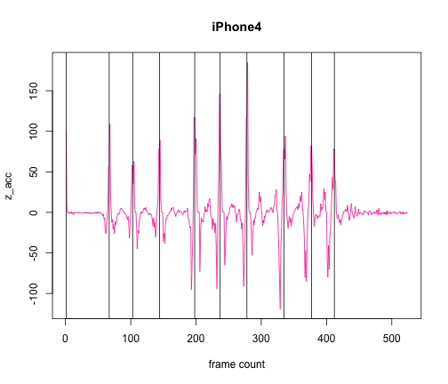
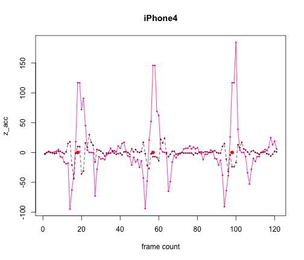
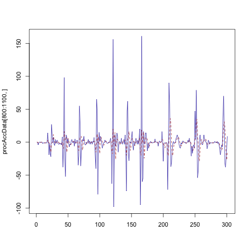

Lifesaver Accelerometer Test
========================================================

A few tests done on accelerometers for the [Lifesaver Project](https://life-saver.org.ok).


```r
# 0001.csv contains all PUSH detections con <- file('./data/0001.csv',
# 'r') accData0001 <- read.csv(con)

# 0002.csv is same as 0001 but PUSH has been removed con <-
# file('./data/0002.csv', 'r') accData0002 <- read.csv(con)

# 0003.csv has a casual cpr at the beginning, then goes crazy sample rate
# is still every 10ms and norms > 9 are boosted with a x3 factor con <-
# file('./data/0003.csv', 'r') accData0003 <- read.csv(con)

con <- file("./data/0004.csv", "r")
accData0004 <- read.csv(con)

close(con)
```


* accData0002 is same accelerometer data as accData0001 where PUSH actions have been removed.
* accData0003 has a casual cpr at the beginning, then goes crazy. sample rate is still every 10ms and norms > 9 are boosted with a x3 factor
* accData0004 traces y with history, data is pre-processed so as to remove gravity

Now we have the data, start with a bit of exploration and create local variables


```r
sapply(accData0004[1, ], class)
```

```
##       X47    X11.75 
## "integer" "numeric"
```

```r
head(accData0004)
```

```
##   X47 X11.75
## 1   2  12.25
## 2   1  12.50
## 3   0  12.50
## 4   0   0.75
## 5  -4  -0.75
## 6  -1  -1.25
```

```r
summary(accData0004)
```

```
##       X47              X11.75      
##  Min.   :-108.00   Min.   :-30.50  
##  1st Qu.:  -3.00   1st Qu.: -2.25  
##  Median :   0.00   Median : -0.25  
##  Mean   :  -0.52   Mean   : -0.47  
##  3rd Qu.:   2.00   3rd Qu.:  1.50  
##  Max.   : 172.00   Max.   : 36.00
```

```r

procAccData <- accData0004
```


procAccData is a subset of accData002 from frame 300 since it's the moment when the relevant CPR action starts. OK, now plot frequency and and scatter.


```r
hist(sample(procAccData[, 1], 300))
```

 

```r
plot(data.frame(cbind(1:length(procAccData[, 1]), procAccData[, 1])), pch = 20, 
    cex = 0.4, col = "#2222AA", type = "o", xlab = "frames", ylab = "y-acc")
```

 

```r
plot(data.frame(cbind(1:length(procAccData[, 2]), procAccData[, 2])), pch = 20, 
    cex = 0.4, col = "#AA2222", type = "o", xlab = "frames", ylab = "y-acc history")
```

 


Subset with history


```r
matplot(procAccData[800:1100, ], type = "l", col = c("#2222AA", "#AA2222"))
```

 

