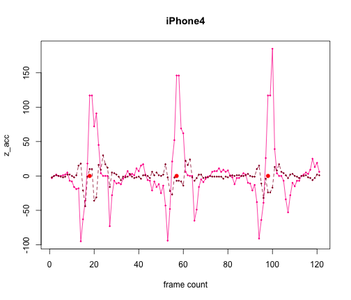

Lifesaver
========================================================

# Analysis recap

* each push is always described by a positive peak of acceleration followed by a negative peak, viceversa for pull gestures
* pull gestures are almost always detected as push (check vertical lines on the rightmost part of each graph, where negative peaks are stronger)
* in theory there are several ways of discriminating push from pull gestures (e.g. principal components, support vector machines, regression models, etc.) but they're all quite expensive both in terms of computation and time of execution. moreover, it's hard to guarantee they would work without accessing to native resources (i.e. through Air)
* it seems there's a problem syncing data coming from accelerometers (push not detected over obvious peaks, i.e. missing vertical lines in the plots below)
* threshold for push action seems that can be defined for operating systems families (ios and android) without need of specifying device (i.e. values of 50~100 should probably fit most of the devices)
* noise is higher on mobile devices rather than tablets (readable from histograms), reasons could be less weight and less accuracy in accelerometers

## Conclusions

Feels it's possible to implement accelerometers for CPR given that:

1. we provide a fallback in case the values read from accelerometers are too weak or too noisy. fallback could be: restart of CPR action with sensible areas that will be pushed with thumbs

2. we allow around 10-20% tolerance on the total number and time interval of pushes

3. we keep a relaxed policy towards weird gestures, such as pulls instead of pushes

## Data sources

Setup data sources and download CSV files


```r
csvurl_iPhone4 <- "https://docs.google.com/spreadsheet/pub?key=0AtTfKjiuuoBPdDF4V2FSZ0FlbzVDSllYcTdKMXRobEE&single=true&gid=3&output=csv"
csvurl_iPad2 <- "https://docs.google.com/spreadsheet/pub?key=0AtTfKjiuuoBPdDF4V2FSZ0FlbzVDSllYcTdKMXRobEE&single=true&gid=12&output=csv"
csvurl_iPod3 <- "https://docs.google.com/spreadsheet/pub?key=0AtTfKjiuuoBPdDF4V2FSZ0FlbzVDSllYcTdKMXRobEE&single=true&gid=11&output=csv"
csvurl_NexusS <- "https://docs.google.com/spreadsheet/pub?key=0AtTfKjiuuoBPdDF4V2FSZ0FlbzVDSllYcTdKMXRobEE&single=true&gid=6&output=csv"
csvurl_Nexus10 <- "https://docs.google.com/spreadsheet/pub?key=0AtTfKjiuuoBPdDF4V2FSZ0FlbzVDSllYcTdKMXRobEE&single=true&gid=13&output=csv"
csvurl_SamGalaxyS2 <- "https://docs.google.com/spreadsheet/pub?key=0AtTfKjiuuoBPdDF4V2FSZ0FlbzVDSllYcTdKMXRobEE&single=true&gid=10&output=csv"
csvurl_SamGalaxyTab <- "https://docs.google.com/spreadsheet/pub?key=0AtTfKjiuuoBPdDF4V2FSZ0FlbzVDSllYcTdKMXRobEE&single=true&gid=7&output=csv"
csvurl_AsusEEE <- "https://docs.google.com/spreadsheet/pub?key=0AtTfKjiuuoBPdDF4V2FSZ0FlbzVDSllYcTdKMXRobEE&single=true&gid=8&output=csv"

# Uncomment below to download the files again
download.file(csvurl_iPhone4, destfile = "../data/iPhone4.csv", method = "curl")
download.file(csvurl_iPad2, destfile = "../data/iPad2.csv", method = "curl")
download.file(csvurl_iPod3, destfile = "../data/iPod3.csv", method = "curl")
download.file(csvurl_NexusS, destfile = "../data/NexusS.csv", method = "curl")
download.file(csvurl_Nexus10, destfile = "../data/Nexus10.csv", method = "curl")
download.file(csvurl_SamGalaxyS2, destfile = "../data/SamGalaxyS2.csv", method = "curl")
download.file(csvurl_SamGalaxyTab, destfile = "../data/SamGalaxyTab.csv", method = "curl")
download.file(csvurl_AsusEEE, destfile = "../data/AsusEEE.csv", method = "curl")

iPhone4_data <- read.csv("../data/iPhone4.csv")
iPad2_data <- read.csv("../data/iPad2.csv")
iPod3_data <- read.csv("../data/iPod3.csv")
NexusS_data <- read.csv("../data/NexusS.csv")
Nexus10_data <- read.csv("../data/Nexus10.csv")
SamGalaxyS2_data <- read.csv("../data/SamGalaxyS2.csv")
SamGalaxyTab_data <- read.csv("../data/SamGalaxyTab.csv")
AsusEEE_data <- read.csv("../data/AsusEEE.csv")
```


# Apple

## iPhone4

Summary


```r
summary(iPhone4_data)
```

```
##      z_acc             y_acc        push_detect    
##  Min.   :-119.00   Min.   :-44.0   Min.   :0.0000  
##  1st Qu.:  -5.00   1st Qu.: -2.0   1st Qu.:0.0000  
##  Median :   0.00   Median :  0.0   Median :0.0000  
##  Mean   :   1.26   Mean   : -0.6   Mean   :0.0191  
##  3rd Qu.:   3.00   3rd Qu.:  1.0   3rd Qu.:0.0000  
##  Max.   : 185.00   Max.   : 30.0   Max.   :1.0000
```


Histogram and data plots


```r
hist(iPhone4_data$z_acc)
```

 

```r
plot(iPhone4_data$z_acc, type = "l", pch = 20, cex = 0.4, col = "#ff0099", xlab = "frame count", 
    ylab = "z_acc", main = "iPhone4")
abline(v = which(iPhone4_data$push_detect == 1), col = "#000000")
```

 

```r

matplot(cbind(iPhone4_data$z_acc, iPhone4_data$y_acc)[180:300, ], type = "o", 
    pch = 20, cex = 0.4, col = c("#ff0099", "#990033"), xlab = "frame count", 
    ylab = "z_acc", main = "iPhone4")
points(which(iPhone4_data$push_detect == 1) - 180, rep(0, length(which(iPhone4_data$push_detect == 
    1))), cex = 1.4, pch = 20, col = "red")
```

 


## iPad2

Summary


```r
summary(iPad2_data)
```

```
##      z_acc             y_acc          push_detect      z_dynpeak   
##  Min.   :-179.00   Min.   :-125.00   Min.   :0.000   Min.   :25.0  
##  1st Qu.: -10.00   1st Qu.:  -3.00   1st Qu.:0.000   1st Qu.:34.2  
##  Median :   0.00   Median :  -1.00   Median :0.000   Median :39.0  
##  Mean   :   1.28   Mean   :  -0.86   Mean   :0.024   Mean   :39.0  
##  3rd Qu.:   9.00   3rd Qu.:   1.00   3rd Qu.:0.000   3rd Qu.:42.0  
##  Max.   : 253.00   Max.   :  53.00   Max.   :1.000   Max.   :66.0
```


Histogram and data plots


```r
hist(iPad2_data$z_acc)
```

 

```r
plot(iPad2_data$z_acc[50:350], type = "o", pch = 20, cex = 0.4, col = "#ff0099", 
    xlab = "frame count", ylab = "z_acc", main = "iPad2")
lines(iPad2_data$z_dynpeak[50:350], col = "blue")
points(which(iPad2_data$push_detect == 1) - 50, rep(0, length(which(iPad2_data$push_detect == 
    1))), cex = 1.4, pch = 20, col = "blue")
```

 


## iPod3

Summary


```r
summary(iPod3_data)
```

```
##      z_acc            y_acc         push_detect     z_dynpeak   
##  Min.   :-211.0   Min.   :-87.00   Min.   :0.00   Min.   :33.0  
##  1st Qu.:  -7.0   1st Qu.: -4.00   1st Qu.:0.00   1st Qu.:41.0  
##  Median :  -1.0   Median : -1.00   Median :0.00   Median :49.0  
##  Mean   :   2.2   Mean   : -0.43   Mean   :0.02   Mean   :54.9  
##  3rd Qu.:   6.5   3rd Qu.:  3.00   3rd Qu.:0.00   3rd Qu.:67.0  
##  Max.   : 349.0   Max.   : 92.00   Max.   :1.00   Max.   :90.0
```


Histogram and data plots


```r
hist(iPod3_data$z_acc)
```

 

```r
plot(iPod3_data$z_acc[100:450], type = "o", pch = 20, cex = 0.4, col = "#ff0099", 
    xlab = "frame count", ylab = "z_acc", main = "iPod3")
lines(iPod3_data$z_dynpeak[100:450], col = "blue")
points(which(iPod3_data$push_detect == 1) - 100, rep(0, length(which(iPod3_data$push_detect == 
    1))), cex = 1.4, pch = 20, col = "blue")
```

 


# Vanilla Android

## Nexus S

Summary


```r
summary(NexusS_data)
```

```
##      z_acc            y_acc         push_detect       z_dynpeak   
##  Min.   :-346.0   Min.   :-77.00   Min.   :0.0000   Min.   :20.0  
##  1st Qu.:  -8.0   1st Qu.: -2.00   1st Qu.:0.0000   1st Qu.:28.0  
##  Median :   0.0   Median :  1.00   Median :0.0000   Median :36.0  
##  Mean   :  11.7   Mean   : -0.97   Mean   :0.0803   Mean   :45.5  
##  3rd Qu.:  17.0   3rd Qu.:  4.00   3rd Qu.:0.0000   3rd Qu.:60.0  
##  Max.   : 368.0   Max.   : 58.00   Max.   :1.0000   Max.   :81.0
```


Histogram and data plots


```r
hist(NexusS_data$z_acc)
```

 

```r
plot(NexusS_data$z_acc, type = "o", pch = 20, cex = 0.4, col = "#9900ff", xlab = "frame count", 
    ylab = "z_acc", main = "Nexus S")
points(which(NexusS_data$push_detect == 1), rep(0, length(which(NexusS_data$push_detect == 
    1))), cex = 1.5, pch = 20, col = "red")
lines(NexusS_data$z_dynpeak, col = "blue")
```

 


## Nexus 10

Summary


```r
summary(Nexus10_data)
```

```
##      z_acc            y_acc         push_detect       z_dynpeak   
##  Min.   :-227.0   Min.   :-76.00   Min.   :0.0000   Min.   :32.0  
##  1st Qu.: -22.0   1st Qu.: -5.00   1st Qu.:0.0000   1st Qu.:39.0  
##  Median :  -1.0   Median : -1.00   Median :0.0000   Median :44.0  
##  Mean   :   8.1   Mean   : -1.58   Mean   :0.0422   Mean   :51.6  
##  3rd Qu.:  14.0   3rd Qu.:  3.00   3rd Qu.:0.0000   3rd Qu.:61.0  
##  Max.   : 398.0   Max.   : 52.00   Max.   :1.0000   Max.   :90.0
```


Histogram and data plots


```r
hist(Nexus10_data$z_acc)
```

 

```r
plot(Nexus10_data$z_acc[30:190], type = "o", pch = 20, cex = 0.4, col = "#9900ff", 
    xlab = "frame count", ylab = "z_acc", main = "Nexus 10")
points(which(Nexus10_data$push_detect == 1) - 30, rep(0, length(which(Nexus10_data$push_detect == 
    1))), col = "red", pch = 20, cex = 1.5)
lines(Nexus10_data$z_dynpeak, col = "red")
```

 


# Propietary Android implementations

## Samsung Galaxy S2

Summary


```r
summary(SamGalaxyS2_data)
```

```
##      z_acc            y_acc          push_detect       z_dynpeak   
##  Min.   :-243.0   Min.   :-116.00   Min.   :0.0000   Min.   :27.0  
##  1st Qu.: -21.0   1st Qu.:  -7.00   1st Qu.:0.0000   1st Qu.:52.0  
##  Median :   0.0   Median :  -1.00   Median :0.0000   Median :68.0  
##  Mean   :   6.9   Mean   :  -0.12   Mean   :0.0335   Mean   :65.2  
##  3rd Qu.:  12.0   3rd Qu.:   3.00   3rd Qu.:0.0000   3rd Qu.:81.0  
##  Max.   : 376.0   Max.   : 140.00   Max.   :1.0000   Max.   :92.0
```


Histogram and data plots


```r
hist(SamGalaxyS2_data$z_acc)
```

 

```r
plot(SamGalaxyS2_data$z_acc[20:170], type = "o", pch = 20, cex = 0.4, col = "#0099ff", 
    xlab = "frame count", ylab = "z_acc", main = "Samsung Galaxy S2")
points(which(SamGalaxyS2_data$push_detect == 1), rep(0, length(which(SamGalaxyS2_data$push_detect == 
    1))), pch = 20, cex = 1.5, col = "red")
lines(SamGalaxyS2_data$z_dynpeak, col = "red")
```

 


## Samsung Galaxy Tab 10

Summary


```r
summary(SamGalaxyTab_data)
```

```
##      z_acc             y_acc         push_detect       z_dynpeak   
##  Min.   :-308.00   Min.   :-99.00   Min.   :0.0000   Min.   :20.0  
##  1st Qu.:  -4.75   1st Qu.: -3.00   1st Qu.:0.0000   1st Qu.:28.0  
##  Median :  -1.00   Median :  0.00   Median :0.0000   Median :46.0  
##  Mean   :   9.38   Mean   : -0.75   Mean   :0.0656   Mean   :45.6  
##  3rd Qu.:  11.00   3rd Qu.:  3.75   3rd Qu.:0.0000   3rd Qu.:62.0  
##  Max.   : 265.00   Max.   : 82.00   Max.   :1.0000   Max.   :62.0
```


Histogram and data plots


```r
hist(SamGalaxyTab_data$z_acc)
```

 

```r
plot(SamGalaxyTab_data$z_acc[20:90], type = "o", pch = 20, cex = 0.4, col = "#0099ff", 
    xlab = "frame count", ylab = "z_acc", main = "Samsung Galaxy Tab")
points(which(SamGalaxyTab_data$push_detect == 1) - 20, rep(0, length(which(SamGalaxyTab_data$push_detect == 
    1))), cex = 1.5, pch = 20, col = "red")
lines(SamGalaxyTab_data$z_dynpeak[20:90], col = "red")
```

 


## Asus EEE

Summary


```r
summary(AsusEEE_data)
```

```
##      z_acc             y_acc         push_detect       z_dynpeak   
##  Min.   :-303.00   Min.   :-94.00   Min.   :0.0000   Min.   :20.0  
##  1st Qu.:  -8.00   1st Qu.: -2.00   1st Qu.:0.0000   1st Qu.:30.0  
##  Median :   0.00   Median : -1.00   Median :0.0000   Median :44.0  
##  Mean   :   6.61   Mean   : -0.41   Mean   :0.0593   Mean   :41.4  
##  3rd Qu.:  11.00   3rd Qu.:  3.00   3rd Qu.:0.0000   3rd Qu.:52.0  
##  Max.   : 290.00   Max.   : 79.00   Max.   :1.0000   Max.   :59.0
```


Histogram and data plots


```r
hist(AsusEEE_data$z_acc)
```

 

```r
plot(AsusEEE_data$z_acc[10:100], type = "o", pch = 20, cex = 0.4, col = "#999900", 
    xlab = "frame count", ylab = "z_acc", main = "Asus EEE")
points(which(AsusEEE_data$push_detect == 1) - 10, rep(0, length(which(AsusEEE_data$push_detect == 
    1))), col = "blue", pch = 20, cex = 1.5)
lines(AsusEEE_data$z_dynpeak, col = "blue")
```

 

